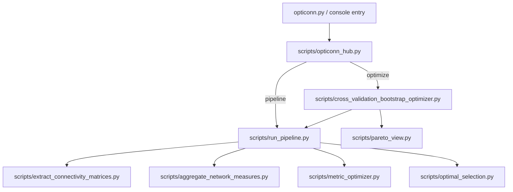

# OptiConn Pipeline

OptiConn turns raw DSI Studio tractography files into analysis-ready brain connectivity datasets. This README walks you through installation, the standard workflow, advanced tuning, and how the scripts relate to one another.

---

## 🔧 Installation Guide

### 1. Prerequisites

- Python 3.10 or newer (the bundled virtual environment targets 3.10)
- Git and basic build tools (`build-essential` on Linux, Xcode Command Line Tools on macOS)
- [DSI Studio](https://dsi-studio.labsolver.org/) installed locally; note the executable path for later
- At least 20 GB free disk space for intermediate results

### 2. Quick install (macOS & Linux)

```bash
# Clone the repository
git clone https://github.com/MRI-Lab-Graz/braingraph-pipeline.git
cd braingraph-pipeline

# Provision the curated virtual environment
bash install.sh
source braingraph_pipeline/bin/activate

# Point the pipeline at your DSI Studio binary
export DSI_STUDIO_CMD=/path/to/dsi_studio
```

### 3. Quick install (Windows PowerShell)

```powershell
git clone https://github.com/MRI-Lab-Graz/braingraph-pipeline.git
cd braingraph-pipeline

# Create the Windows venv with pinned dependencies
./install_windows.bat

# Activate and set the DSI Studio path
braingraph_pipeline\Scripts\activate.bat
setx DSI_STUDIO_CMD "C:\\Program Files\\dsi_studio\\dsi_studio.exe"
```

### 4. Verify the setup

```bash
source braingraph_pipeline/bin/activate
python scripts/validate_setup.py --config configs/braingraph_default_config.json
```

The validator checks Python dependencies, DSI Studio accessibility, and configuration basics.

---

## 🚀 Standard Pipeline

The everyday workflow uses three stages. The `opticonn pipeline` command orchestrates everything and can disable emoji output for Windows terminals.

| Step | Purpose | Primary Script | Typical Output |
| ---- | ------- | -------------- | -------------- |
| 01 | Batch connectivity extraction from `.fz` / `.fib.gz` | `scripts/extract_connectivity_matrices.py` | `01_connectivity/` with per-atlas matrices and `batch_processing_summary.json` |
| 02 | Network quality optimisation | `scripts/metric_optimizer.py` | `02_optimization/optimized_metrics.csv`, logs, and reports |
| 03 | Quality-based selection & analysis-ready exports | `scripts/optimal_selection.py` | `03_selection/*_analysis_ready.csv`, `optimal_selection_summary.txt` |

### One-line standard run

```bash
python opticonn.py --no-emoji pipeline --step all \
  --input /data/fiber_bundles \
  --output studies/demo_run
```

- `--step all` runs 01 → 03 in sequence.
- The command autodetects `configs/braingraph_default_config.json`; override with `--config` if needed.
- `--no-emoji` keeps Windows consoles stable but works cross-platform.

### What you get

```text
studies/demo_run/
├── 01_connectivity/
├── 02_optimization/
└── 03_selection/
    ├── FreeSurferSeg_qa_analysis_ready.csv
    ├── ...
    └── optimal_selection_summary.txt
```

Use the analysis-ready CSV files with R, Python, MATLAB, or JASP for group statistics.

---

## 📌 Key configuration: `configs/braingraph_default_config.json`

This is the primary extraction configuration used by default in both the standard pipeline and the optimizer.

What it defines:

- `dsi_studio_cmd`: path to the DSI Studio executable
- `atlases`: which atlases to extract (e.g., FreeSurferDKT_Cortical, FreeSurferDKT_Tissue, FreeSurferSeg)
- `connectivity_values`: metrics such as `count`, `fa`, `qa`, `ncount2`
- `tract_count`, `thread_count`, and detailed `tracking_parameters`
- `connectivity_options`: output types and thresholds
- `sweep_parameters`: ranges (supports MATLAB-style strings like `0.3:0.2:0.7`) and sampling method (`grid`, `random`, `lhs`)

Where it’s used by default:

- `opticonn pipeline …` Step 01 passes this file unless you override `--extraction-config`.
- `opticonn optimize …` generates wave configs referencing this file under `pipeline_config.extraction_config`.

How to override it:

```bash
python opticonn.py pipeline --step all \
   --input /path/to/fz \
   --output studies/custom_run \
   --extraction-config configs/my_custom_config.json
```

Validation and schema:

- Validate: `python scripts/json_validator.py configs/braingraph_default_config.json`
- Schema reference: `dsi_studio_config_schema.json`

Runtime confirmation:

- The pipeline and optimizer echo the exact extraction config path they are using to the terminal for transparency.

---

## 🧪 Practical Walk-through

Below is a concrete session for a fictional dataset stored in `/data/P124`.

1. **Activate the environment and export the DSI Studio path**

   ```bash
   source braingraph_pipeline/bin/activate
   export DSI_STUDIO_CMD=/Applications/dsi_studio.app/Contents/MacOS/dsi_studio
   ```

2. **Run a full pass**

   ```bash
   python opticonn.py --no-emoji pipeline --step all \
     --input /data/P124/fibers \
     --output studies/p124_wave1
   ```

3. **Review highlights**
   - `studies/p124_wave1/02_optimization/optimized_metrics.csv`: quality scores per atlas/metric
   - `studies/p124_wave1/03_selection/*analysis_ready.csv`: subject × metric tables ready for stats
   - `studies/p124_wave1/03_selection/optimal_selection_summary.txt`: textual summary & top picks

4. **Re-run only optimisation and selection (skipping extraction)**

   ```bash
   python opticonn.py --no-emoji pipeline --step analysis \
     --output studies/p124_wave1
   ```

   This uses existing Step 01 results under the same output folder.

---

## 🧠 Expert Settings & Advanced Toolkit

### Global CLI switches

| Flag | Applies to | Description |
| ---- | ---------- | ----------- |
| `--no-emoji` | All entry points | Strips emoji from stdout/stderr (Windows-safe) |
| `--quiet` | `pipeline`, `optimize`, `analyze` | Minimal console noise (warnings/errors only) |
| `--step` | `pipeline` | `01`, `02`, `03`, `analysis`, or `all` |
| `--config` | `pipeline`, `optimize` | Alternative extraction configuration JSON |
| `--cross-validated-config` | `pipeline` | Derive custom extraction config from cross-validation outputs |
| `--data-dir` / `--input` | Context-specific | Provide raw data or precomputed inputs |
| `--output` | Context-specific | Set working directory for generated artefacts |
| `--pareto-report` | `optimize` | After optimization, auto-generate Pareto front CSV/PNG under `optimization_results/` |

### Per-step control

- **Extraction (Step 01)** accepts `--batch`, `--pilot`, atlas lists, and tracking parameter overrides (see `scripts/extract_connectivity_matrices.py --help`).
- **Optimisation (Step 02)** exposes statistical thresholds, plotting, and custom configs (`scripts/metric_optimizer.py --help`).
- **Selection (Step 03)** allows alternative strategies and plot generation via `scripts/optimal_selection.py --plots`.

### JSON configuration workflows

Store reproducible runs in JSON files under `configs/`, then launch with:

```bash
python scripts/cross_validation_bootstrap_optimizer.py --config configs/bootstrap_optimization_config.json
```

This orchestrates multiple runs and can feed results back into the main pipeline (`opticonn optimize` → `opticonn analyze`).

### Utility scripts for power users

| Script | When to use it |
| ------ | ------------- |
| `scripts/aggregate_network_measures.py` | Merge per-subject `network_measures.csv` files (used internally by Step 02) |
| `scripts/cross_validation_bootstrap_optimizer.py` | Automated multi-wave QA or parameter sweeps |
| `scripts/bootstrap_qa_validator.py` | Post-hoc QA of bootstrap campaigns |
| `scripts/json_validator.py` | Validate configuration files before launching long jobs |
| `scripts/quick_quality_check.py` | Spot-check diversity and sparsity of intermediate outputs |
| `scripts/pareto_view.py` | Build a Pareto front over combinations using persisted diagnostics |

---

## 🗺️ Script Map (Mermaid)



**How to read it:**

- `opticonn.py` is the legacy shim that forwards to `opticonn_hub`. You can also run `python -m opticonn` after installing as a package.
- The hub delegates to `run_pipeline.py` for the three core stages or to the cross-validation harness for research campaigns.
- The pipeline then chains extraction → aggregation → optimisation → selection.

---

## 📚 Script-by-Script Reference

| Location | Role |
| -------- | ---- |
| `opticonn.py` | Backwards-compatible CLI entry (`python opticonn.py …`) |
| `scripts/opticonn_hub.py` | Primary CLI router implementing `opticonn pipeline`, `opticonn optimize`, `opticonn analyze`, and `opticonn apply` |
| `scripts/run_pipeline.py` | High-level orchestrator for steps 01–03, handles `--step`, emoji suppression, and environment propagation |
| `scripts/extract_connectivity_matrices.py` | Interfaces with DSI Studio, organises outputs by atlas/metric, supports batch and pilot modes |
| `scripts/aggregate_network_measures.py` | Consolidates per-subject network metrics into a single CSV (invoked automatically) |
| `scripts/metric_optimizer.py` | Scores atlas/metric combinations based on sparsity, modularity, efficiency, reliability |
| `scripts/optimal_selection.py` | Picks top combinations and exports analysis-ready tables |
| `scripts/cross_validation_bootstrap_optimizer.py` | Runs multi-wave QA and optimisation campaigns, feeds results back to the pipeline |
| `scripts/bootstrap_qa_validator.py` | Validates QA batches and aggregates reports |
| `scripts/json_validator.py` | Schema-aware validation for configuration files |

---

## ✅ Next Steps

1. Install the environment and configure DSI Studio.
2. Run `python opticonn.py --no-emoji pipeline --step all …` on a small pilot set.
3. Inspect the generated CSVs, tweak configs, and iterate.
4. Use the expert toolkit for large-scale sweeps or custom QA.

If you encounter platform-specific questions, open an issue on GitHub or consult `docs/` for deeper dives into configuration specifics.

---

## 📊 Persisted Diagnostics & Pareto View

Every sweep combination now writes a compact `diagnostics.json` capturing parameters, scores, and key network measures. Each wave also produces `combo_diagnostics.csv` for quick inspection and meta-analysis.

Example locations after an optimize run:

```text
studies/<name>/optimize/<wave>/combos/sweep_0001/diagnostics.json
studies/<name>/optimize/<wave>/combo_diagnostics.csv
```

### Generate a Pareto front

The Pareto utility surfaces combinations that jointly balance:

- Higher score (default: `quality_score_raw_mean`)
- Lower cost (`tract_count`)
- Smaller density deviation (distance to preferred corridor)

Run it on one or more waves and write outputs to an `optimization_results` folder:

```bash
source braingraph_pipeline/bin/activate
python scripts/pareto_view.py \
   studies/diagtest/optimize/bootstrap_qa_wave_1 \
   studies/diagtest/optimize/bootstrap_qa_wave_2 \
   -o studies/diagtest/optimize/optimization_results --plot
```

Outputs:

- `pareto_front.csv`: Pareto-efficient combinations across inputs
- `pareto_candidates_with_objectives.csv`: all combos with computed objectives
- `pareto_front.png` (when `--plot` is set): scatter with Pareto points highlighted

Tuning:

- `--score selection_score` uses the selection score from Step 02 instead of raw mean
- `--density-range 0.08 0.25` adjusts the preferred density corridor

Tip: you can have this produced automatically after an optimize run by adding `--pareto-report` to `opticonn optimize`:

```bash
opticonn optimize -i /path/to/fz -o studies/run1 --quick --pareto-report
```
